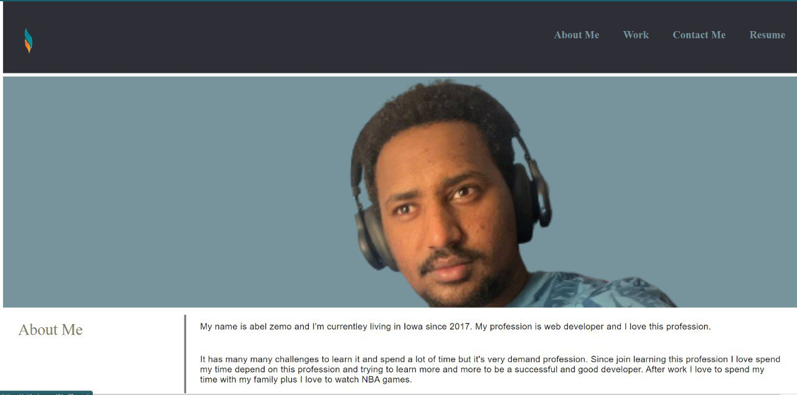
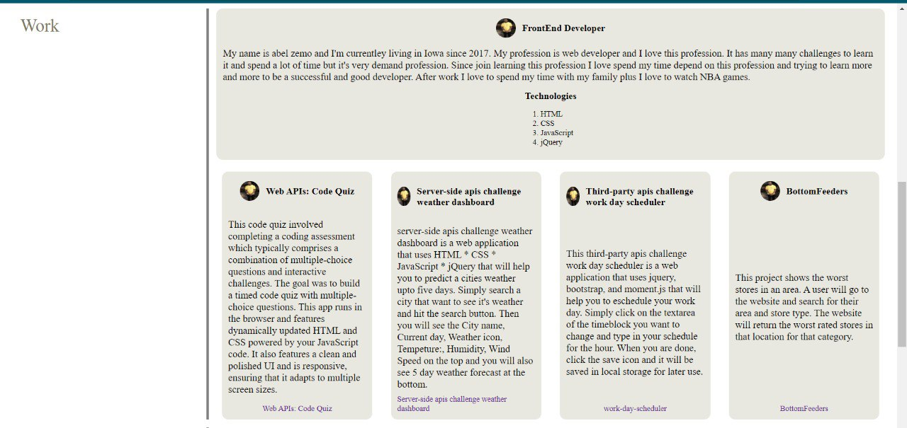
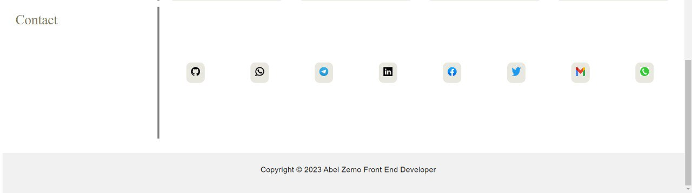
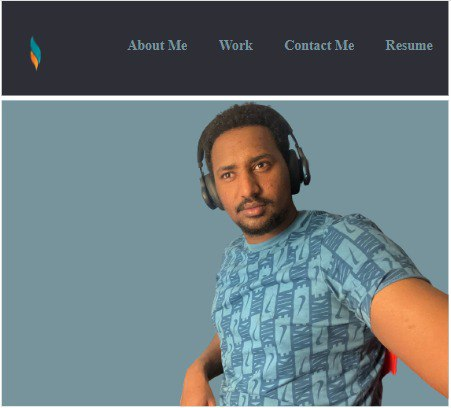

# Abel’s personal website or portfolio

# Description:

This is a personal website which shows my previous work experience, describes me as a professional and also briefs my current status by including deployed projects.

# Usage:

To use (see) this website , we only need internet to load the hosted page and a computer to see the UI and access it -Since this is simple website one can use it by scrolling and surfing through it #history This project was first given by our instructor to build it from scratch After using the given portfolio I built my own portfolio by including user requirements in the assignment and made the page look professional using advanced css Now I deployed fully functional portfolio for me to be expressed as a developer.

# Technology Used:

* HTML
* CSS
* JavaScript
* jQuery

# Installation

first of all you need to have Node invironment in your local machine to run javascript file

step 1 : clone my repository to your local machine

step 2 :  open in terminal if you are in mac or linux operating system or in command prompt if you are in window

step 3 : type this command  ( cd Abel-Portfolio ) to navigate to the project

step 4 : type this command ( code .) this helps to open in VS code

step 5 : when you are in VS code click the terminal tab from the VS code to open a terminal from VS code

step 6 : then type git status or git branch and make sure you are on the main branch

step 7 : finally go to the index.html run it . just open it using live server and see the result

step 9 : Done That's it.

# Screenshots:

**Done!  congratulations**

Website Link : https://abelzemo.github.io/Abel-Portfolio/
